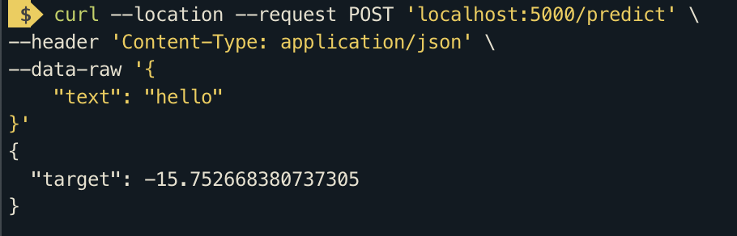

## Stage 1

To reproduce model and metrics locally just run all cels in [notebook](readability-score.ipynb). You also need to import data from competion to your notebook.
On Kaggle - https://www.kaggle.com/yuriihavrylko/readability-score

Pretrained model stored in app folder [model.pkl](app/model.pkl).
For embeddings used Sentence Transformers, model downloaded from HF automatically.

## Stage 2
To build docker image with API:

`docker compose build`

To run API:

`docker compose up`

Call endpoint

```
curl --location --request POST 'localhost:5000/predict' \
--header 'Content-Type: application/json' \
--data-raw '{
    "text": "hello"
}'
```


